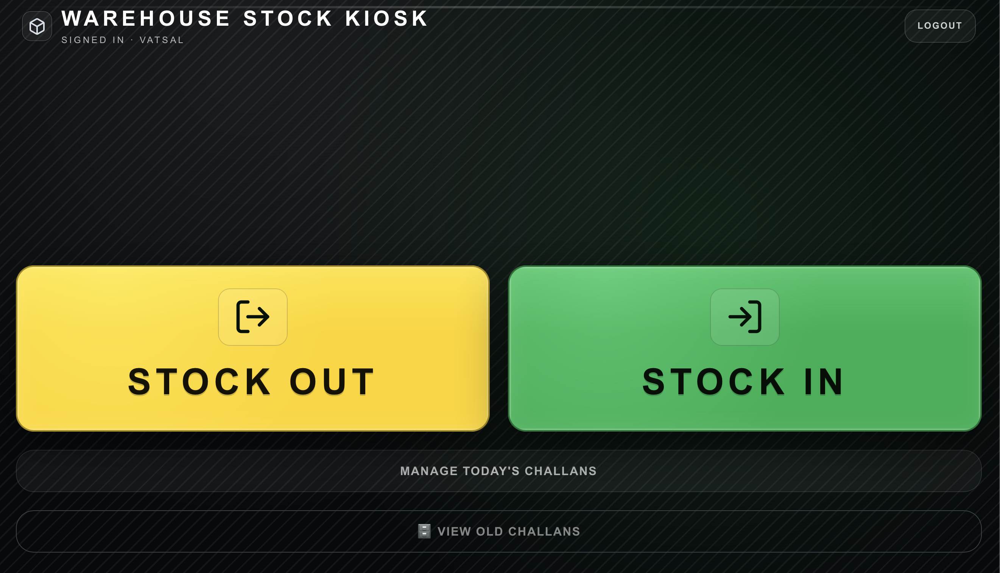
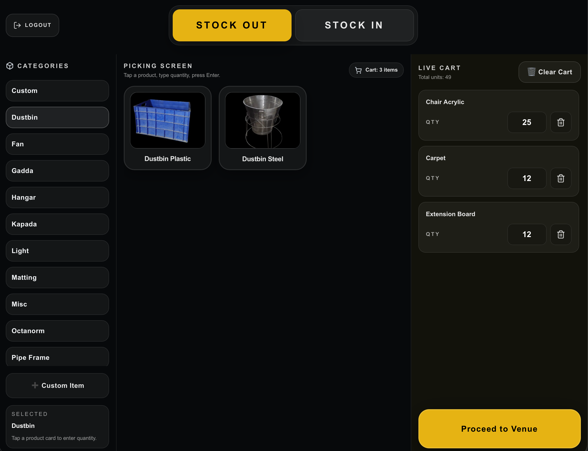

# InventoryFlow: Enterprise Asset Management System

A full-stack, real-time inventory and logistics tracking system designed for high-turnover warehouse environments. This project replaces fragmented manual record-keeping with a resilient, audit-ready digital ledger.

## System Interface

*The main Kiosk landing screen designed for high-speed touch input.*

*The Stock Out picking interface featuring category filtering and real-time cart tallying.*

## 🚀 The Business Problem
Managing thousands of high-turnover physical assets (e.g., event infrastructure, linen, hardware) across multiple venues often leads to "ghost stock" and reconciliation nightmares. I developed this system to move away from static "inventory counts" toward a **transaction-based movement ledger**.

### The Solution
By recording every movement as a discrete event (Transaction ID, Product, Venue, Quantity, Timestamp), the system can reconstruct a perfect stock snapshot for any venue at any point in history.

## 🛠️ Key Features

- **Venue-Centric Tracking:** Real-time "On-Field" balances for every partner venue.
- **Kiosk-Style Entry:** A high-speed UI for warehouse staff with PIN authentication and rapid entry for challan generation.
- **Sequence Ledger (Data Pivoting):** A specialized tool that transforms vertical database records into wide-format chronological reports, optimized for integration with legacy Excel Macros.
- **Automated Audit Reports:** Weekly PDF stock summaries generated server-side and dispatched via SMTP (Hostinger) using Vercel Cron jobs.
- **Admin Analytics:** Deep-dive views into historical movements with color-coded "In/Out" ledgers.

## 💻 Tech Stack

- **Frontend:** Next.js 14 (App Router), React, Tailwind CSS.
- **Backend:** Node.js, Supabase (BaaS).
- **Database:** PostgreSQL with Row-Level Security (RLS) and custom RPC functions for complex aggregations.
- **Reporting:** `jsPDF` for document generation and `Nodemailer` for automated dispatch.

## 🔒 Technical Challenges Solved

### 1. The "Logic Flip" (Warehouse vs. Client View)
Standard warehouse logs show outbound stock as negative. I implemented a UI-layer logic transformation that interprets these negatives as "Positive Client Balances," making it intuitive for the business owner to see exactly what a client "owes."

### 2. Performance at Scale
Instead of calculating stock totals in the browser, I moved the aggregation logic to **PostgreSQL Views and Functions**. This ensures that even with 100,000+ movement records, the dashboard loads in under 200ms.

### 3. Data Compatibility
Created a custom CSV export engine that aligns web-based database architecture with existing financial Excel tools, allowing the business to maintain its established accounting workflows.
